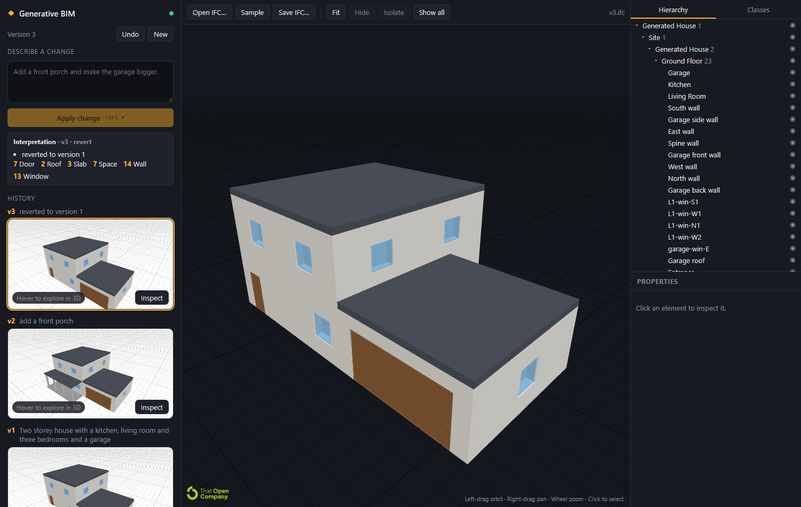

Link to Open-Source Documentation:
https://docs.google.com/document/d/1tU3kCJchFRInzQXuF_GBEn_fQGtBhatj

# Tekt

Text prompt → building model → **IFC**, with the language model kept swappable and the building built
as a stream of small deltas so the user watches it grow and can iterate on it. Python/FastAPI backend
(IfcOpenShell + shapely), React frontend rendering with [That Open](https://github.com/ThatOpen)
(web-ifc + fragments + three.js), wrapped in Tauri for the desktop. Every prompt produces a new project
version, shown as a 3D turn card in the history (`packages/ifc-viewer`).



*"Two storey house with a kitchen, living room and three bedrooms, a garage and a front porch" — mock LLM.*

---

## 1. Design in one page

**The LLM never writes IFC, and never writes a wall.** It writes a checklist, then a stream of small
semantic *steps* (a room here, a door there); deterministic code derives every wall, slab, opening and
roof from those and compiles them to IFC after every step.

```
 prompt ──► LLM: REQUIREMENTS checklist  (atomic, typed, "supported" flag)
        ──► LLM: RESEARCH turns — tool calls into the brick library and skills (search_bricks, get_brick, get_skill …)
        ──► LLM: APPROACH, then BUILD STEPS, streamed
                ├─ half-written step ─► "drafting a window in the kitchen…"  (≈ 6×/s)
                └─ each complete step ─► apply to DESIGN ─► derive ─► preview IFC ─► viewer
                                   (room, door, window, stair, brick, roof …)                     ▲     (≤ 1 s apart)
                 rejected steps ─────────────────────────────── fix round (≤ N) ──────────────────┘
        ──► COORDINATE (clashes, connectors, structural spans) + CHECK against the checklist ──► errors/unmet → fix round
        ──► LOOK: screenshots from camera views the model picks, sent back to it ──► problems it sees → fix round
        ──► CODE SCREEN: IBC/IRC 2021 + ADA clauses on the derived model ──► failing clauses + fix steps → fix round
        ──► derive BuildingSpec (IR) ─► IfcOpenShell compiler (stable GlobalIds) ─► version store ─► viewer
        ──► issue: code review, US NCS drawing set (SVG/PDF), area schedule, UniFormat cost plan,
            upfront carbon (LETI band), BCF 2.1 issues
        ──► export: IFC, drawings PDF, DXF plans, Excel schedules, BCF, estimate CSV, review report, or a bundle of all of it
 edit:  the same, starting from the head version's DESIGN; the model emits only the steps that change it
```

Why this shape:

| Problem with "LLM emits IFC" | What we do instead |
|---|---|
| STEP is a graph of `#123=` references; one wrong id breaks the file | The LLM emits JSON validated by Pydantic; the compiler owns every IFC reference |
| A small house is 50–200k tokens of IFC, ~600 tokens of design | Context for edits is the design rendered as text: rooms with rectangles, exterior sides, neighbours (`core/context.py`) |
| Geometry (placements, boolean openings, closed polygons) is where LLMs fail | LLMs place rectangles on a grid and name sides; `core/derive.py` turns that into walls, openings and roofs that always compile |
| One-shot answers hide what went wrong and show nothing until the end | Every step is applied and rendered as it streams; the step being written is narrated before it lands; a bad step is rejected with a message the model gets back |
| A step log reads like a debug log, so nobody reads it | The model writes its strategy first and one clause of reasoning per move; the backend turns each step into a sentence about the building with the quantities behind it, grouped by the phase of the work (`core/narrate.py`) |
| Detailed prompts lose detail | The checklist is extracted first, carried through the build prompt, checked deterministically at the end, and unmet items trigger a fix round; unsupported wishes are reported, not dropped |
| Text-level diffs of IFC are meaningless (ids renumber) | Ids derive from room ids (`L1-wall-kitchen+hall`), so a room that moves keeps its walls' GlobalIds |
| Swapping the model later | The model only implements `LLM.complete(request, on_text) -> dict` (`llm/base.py`) |

## 2. Repository layout

```
backend/
  schemas/design.py     Design — what the LLM builds: levels, rooms as rectangles, doors, windows, stairs, fixtures, balconies, porch, roof
  schemas/steps.py      Step — the flat step vocabulary the LLM streams, and apply_step (with rejection messages)
  schemas/requirements.py  Requirement checklist (typed, checkable) extracted before building
  schemas/bim.py        BuildingSpec — the geometric IR: walls/slabs/roofs/doors/windows/columns/beams/spaces/stairs/fixtures/railings
  schemas/ops.py        Raw element ops (UI/scripts escape hatch; stored as design overrides)
  schemas/attachments.py  Images attached to a prompt: sniffed, size-capped, content-addressed
  schemas/phases.py     construction phases, derived from an element's IFC class
  core/derive.py        Design → BuildingSpec: walls from room edges, opening placement, stairs, roofs, balconies, porch
  core/rooms.py         room geometry shared by derive and placement: wall pieces, sides, fitting a piece against a wall
  core/derive_bricks.py the building's frames (rooms, site, roof, walls, slabs, placed assets) and brick placement → Asset
  core/placement.py     candidate placements by mount and tags, and first_fit (the first one that derives without a clash)
  core/checks.py        deterministic verification of a design against its requirements
  bricks/               the parametric geometry kernel: expr.py (expressions), geometry.py (nodes → solids),
                        model.py (Brick), place.py (placement against frames), and the JSON library (bricks/library/*.json)
  skills/               assembly know-how the model reads on demand (skills/library/*.md)
  core/research.py      the research loop: the model's tool calls into bricks and skills, collected into a toolbox
  core/look.py          the look loop: screenshots of the model from views it picks, what it sees → a fix round
  render/               headless renderer: scene.py (IFC → triangles), raster.py (numpy z-buffer), caps.py (plan cuts),
                        font.py (labels), png.py; schemas/look.py is the View the model picks
  core/coordinate.py    coordination: clash.py (solid and keep-out clashes), assembly.py (connectors), structure.py (spans)
  core/stream.py        apply steps as they stream; narrate the one being written; worker thread compiles previews
  core/narrate.py       a step → a sentence about the building, its rationale and the quantities behind it
  core/export.py        a version as a deliverable: IFC, summary, spec, design, context, checks, schedule, as a zip
  core/pipeline.py      the run: requirements → build stream → fix rounds → check → compile → version
  core/ops.py           apply raw ops to a spec (pure, cascading deletes, re-validates)
  core/construction.py  live-build job: writes a version's elements to disk one at a time in construction order
  slicer/               horizontal slices of a compiled IFC by construction phase + preview G-code
  core/guids.py         element id ↔ IFC GlobalId map, kept per project
  core/context.py       design / spec → compact text for the LLM
  core/partial_json.py  close the JSON a model has produced so far (only complete array elements survive;
                        peek_element reads the one still being written, for the live "drafting…" line)
  solver/layout.py      two-row packer for rooms that come without a rectangle (mock, fallback)
  llm/                  adapter protocol + mock / llamacpp / claude / ollama / openai-compatible implementations, prompts
  ifc/                  IfcOpenShell compiler: project, walls, slabs, roofs (flat/gable/hip/shed), openings, stairs (+ slab wells),
                        fixtures/railings/beams (a ~60-kind catalogue), geometry helpers; lifter (IFC → spec + design)
  store/db.py           SQLite projects/versions (spec + design + checks + approach + attachments); IFC files,
                        screenshots and attached images under backend/output/projects/<id>/
  api/routes.py         HTTP API; api/sse.py streams pipeline progress as Server-Sent Events
  agents/               stateless planners for /plan and /generate (template regex → steps, llm)
  tests/                pytest; runs entirely on the mock LLM; tests/evals/prompts.json = accuracy set
  tools/eval.py         score the configured model on the evaluation set
frontend/
  src/viewer/BimViewer.ts  That Open wrapper: model tree, properties, class visibility, hide/isolate
  src/api/client.ts        backend client incl. SSE-over-POST parser
  src/App.tsx, main.tsx    React entry point and top-level layout
  src/components/         Sidebar, TopBar, ExportMenu, Workspace, Composer, Reasoning, ViewerOverlays, …
  src/state/attachments.ts images attached to a prompt: read, size/type checked, base64 for the backend
  src/state/trace.ts      the backend's event stream → the reasoning trace, grouped by phase of the work
  src/turns.ts            version history cards, wiring `packages/ifc-viewer`
  src/platform.ts         the only frontend file that knows about Tauri
  src-tauri/              Tauri 2 shell; starts `backend/.venv` python on start, kills it on exit
  scripts/copy-wasm.mjs   copies web-ifc's wasm + fragments worker into public/ (postinstall)
packages/ifc-viewer/     turn-card viewer: snapshot ⇄ live orbitable view, at most 3 live canvases
```

## 3. Running it

Requirements: Python ≥ 3.12 (3.14 tested), Node ≥ 20. For the desktop shell additionally Rust
(`rustup`), the MSVC C++ Build Tools on Windows, and WebView2 (present on Windows 11).

```bash
# backend
cd backend
pip install -r requirements.txt
cp .env.example .env            # optional; defaults to the mock LLM
python main.py                  # http://127.0.0.1:8765
python -m pytest                # 504 tests, ~120 s
python tools/eval.py            # accuracy of the configured model on tests/evals/prompts.json

# frontend (once)
cd frontend
npm install                     # also copies web-ifc.wasm + the fragments worker into public/

# desktop: Vite + Tauri with hot reload; the app starts backend/.venv python if nothing is on 8765
npm run dev
npx tauri build --no-bundle     # release exe under src-tauri/target/release (drop --no-bundle for an installer)

# browser only (no desktop shell); start the backend yourself first
npm run vite:dev                # http://localhost:5173
```

The desktop shell looks for `backend/.venv` and falls back to `python` on the PATH, so create the
venv there.

Environment (see `backend/.env.example`; `.env` is re-read before every LLM call and on `/health`, so
switching provider, model or key takes effect without a restart — only paths and the port need one):

| var | meaning |
|---|---|
| `LLM_PROVIDER` | `mock` (default, no model needed), `llamacpp`, `claude`, `ollama`, `openai` |
| `LLM_MODELS_DIR`, `LLAMA_SERVER`, `LLAMA_GPU_LAYERS`, `LLAMA_CTX` | `llamacpp`: folder of `.gguf` files, server binary, GPU offload (99 = all), context |
| `ANTHROPIC_API_KEY`, `ANTHROPIC_WORKSPACE_ID` | `claude`: key (or an `ant auth login` profile); workspace id only for org-level keys |
| `BIM_LOG_LEVEL` | `INFO` (default) or `DEBUG` (full LLM prompts and replies in the backend console) |
| `LLM_MODEL`, `LLM_BASE_URL`, `LLM_API_KEY` | model id / endpoint / key for the chosen provider |
| `BIM_MAX_REPAIRS` | fix rounds for rejected steps per prompt (default 2) |
| `BIM_VERIFY_ROUNDS` | fix rounds for unmet requirements per prompt (default 1; 0 = report only) |
| `BIM_LOOK_ROUNDS`, `BIM_LOOK_TURNS` | visual reviews per prompt (default 1; 0 = off) and camera turns per review (default 3) |
| `BIM_CODE_ROUNDS` | pre-issue code screens per prompt: failing IBC/IRC clauses and buildable fix steps go back to the model (default 1; 0 = report only) |
| `LLM_EFFORT`, `LLM_THINKING` | `claude`: reasoning effort (`low`/`medium`/`high`, default `medium`) and whether its thinking streams into the trace (`summarized`, default, or `omitted`) |
| `BIM_THINK_EVERY` | seconds between updates of the thinking paragraph still being written (default 0.25) |
| `LLM_VISION` | `1`/`0`: whether the model is sent screenshots; default on for `claude`, Anthropic's endpoint and `mock` |
| `BIM_OUTPUT_DIR`, `BIM_DB_PATH`, `BIM_PORT` | storage and port |
| `BIM_BACKEND_URL` (Tauri) or `?backend=` (browser) | backend origin for the UI, default `http://127.0.0.1:8765` |
| `BIM_NO_BACKEND`, `BIM_BACKEND_DIR` (Tauri) | don't spawn the backend / where `backend/` is |
| `BIM_AUTOLOAD`, `BIM_PROMPT`, `BIM_SMOKE_SELECT` (Tauri) | smoke-test hooks: load a file, run a prompt, select an element class |

**Local `.gguf` models.** Fetch a prebuilt `llama-server` once, then point the backend at your model
folder; the server is started on first use and stopped with the backend:

```bash
cd backend
python tools/get_llama.py            # Vulkan build: any GPU, no CUDA toolkit (--backend cpu | cuda-13.4 also work)
# backend/.env
LLM_PROVIDER=llamacpp
LLM_MODELS_DIR=D:\Models
LLM_MODEL=llama-3.2-3b-instruct-q4_k_m.gguf
```

**Claude.** `LLM_PROVIDER=claude` and `ANTHROPIC_API_KEY=sk-ant-…` in `backend/.env` (optionally
`LLM_MODEL=claude-sonnet-5` for cheaper runs). A key created at organisation level rather than inside a
workspace is rejected with *"must include the anthropic-workspace-id header"* — add
`ANTHROPIC_WORKSPACE_ID=wrkspc_…` (Console → Settings → Workspaces) or create the key inside a workspace.

**Claude Opus 5.5 through the OpenAI API spec (current default).** Anthropic serves
`/v1/chat/completions`; the `openai` provider targets it directly (keys go in `.env`; `${VAR}` references
expand to variables defined above them):

```
CLAUDE_KEY=sk-ant-…
LLM_PROVIDER=openai
LLM_BASE_URL=https://api.anthropic.com/v1
LLM_MODEL=claude-opus-5-5
LLM_API_KEY=${CLAUDE_KEY}
```

The adapter handles that host's quirks: `temperature` is omitted (Claude 5 rejects it), numeric bounds
are stripped from the schema (its validator rejects `minimum`/`maximum`), and if the endpoint ever answers
*"the compiled grammar is too large"* the request is retried once without constrained decoding (the step
log shows the note; Pydantic + the repair loop validate on our side). Measured on the family-house prompt
in §4.3: checklist 11 s, then ~22 s before the first step (server-side latency; a trivial request answers
in 1.6 s), then 77 steps at a median 0.8 s apart with 73 previews rendered; 15/16 requirements met.
Edits 2 min including a fix round. `LLM_PROVIDER=claude` uses the native SDK with structured outputs.

**Fireworks (or any other OpenAI-compatible API).** Same provider, streaming from `/chat/completions`
with a JSON-schema `response_format`: `LLM_BASE_URL=https://api.fireworks.ai/inference/v1`,
`LLM_MODEL=accounts/fireworks/models/qwen3p8-max`, `LLM_API_KEY=fw_…`. The same provider covers vLLM,
LM Studio, a hosted API or a fine-tuned model. **Ollama:** `LLM_PROVIDER=ollama LLM_MODEL=llama3.1`.

**Recorded runs and replay.** Every prompt run is recorded next to its version (`projects/<id>/v<n>.run.json`).
The home screen lists runs made by a real model under *Recorded runs*; clicking one plays it back ten
times faster — the model's thinking, every step, the build previews, the screenshots it checked and the
deliverables — and the session then continues on that project, so the next prompt edits the recorded
building. `?replay=<project>[:<version>]&speed=` does the same from a URL. `python tools/pack_run.py
<project> <name>` packs a run into `backend/demo/<name>.zip`; the backend restores every pack in `demo/`
(`BIM_DEMO_DIR`) at startup, so a machine with no API key can still show a real Claude run.
Two ship with the repo:

- `demo/architecture-studio.zip`: a 40-person studio over two floors, 366 elements, 13 of 15 code clauses
  passing, 6½ minutes live.
- `demo/primary-school.zip`: a two-storey school for 180 pupils, 504 elements. The pre-issue code screen
  finds a clause failing, hands it back, and Claude fits out an accessible WC before the set is issued with
  nothing failing. 8¾ minutes live, about a minute at the default replay speed.

## 4. Specifications

### 4.1 Design — what the LLM builds

`backend/schemas/design.py`. Semantic, but with coarse geometry: rooms are axis-aligned rectangles
`[x, y, width, depth]` (metres, `(x, y)` = south-west corner, x east, y north) or, when the plan needs
it, polygons `poly: [[x,y], …]` listed counter-clockwise whose edges may be arcs
(`{"to":[x,y],"through":[x,y]}`, a three-point arc faceted at 0.25 m) or open (`{"to":[x,y],"open":true}`:
no wall, columns instead). The polygon is the inner face of the walls, so the area the model states is
the area the checks measure. Everything else refers to rooms and walls; a wall is named by `side`
(N/S/E/W, the compass direction its outside faces; enough for rectangles) or by `near: [x, y]`, a point
on or next to it (any shape; required when a room has two walls facing the same way). `roofed: false`
(courtyard, terrace) and `enclosed: false` (carport, pergola) are set by the room kind and can be
overridden. `elements` holds free-standing walls (polylines, arcs allowed), slabs, roofs, columns and
beams outside the room system; a door or window can sit in a free wall via `wall: <id>`, and `elevation`
raises an element above its level (a bridge deck on piers). A design may hold no rooms at all: a footbridge
is a level with piers, girders, a deck and parapets, and the pipeline accepts it (`agents/shapes.py::bridge_steps`
is the template's version).

```jsonc
{
  "name": "Family House", "description": "…",
  "levels":    [{"id": "L1", "name": "Ground Floor", "height": 3.0}, {"id": "L2", "height": 2.8}],
  "rooms":     [{"id": "kitchen", "name": "Kitchen", "level": "L1", "kind": "kitchen", "rect": [3, 5, 3, 5]}, …],
  "doors":     [{"id": "door-kitchen-hall", "room": "kitchen", "to": "hall", "at": 0.5, "kind": "single"},
                {"id": "door-hall-s", "room": "hall", "to": "outside", "side": "S"}],
  "windows":   [{"id": "win-kitchen-N", "room": "kitchen", "side": "N", "at": 0.5, "kind": "large"}],
  "stairs":    [{"id": "stair-hall", "room": "hall", "side": "W", "to_level": null}],
  "fixtures":  [{"id": "fridge-kitchen", "room": "kitchen", "kind": "fridge", "side": "E", "at": 0.8}],
  "balconies": [{"id": "balcony-master-bedroom-S", "room": "master-bedroom", "side": "S", "depth": 1.5}],
  "porch": {"side": "S", "depth": 2.4},
  "roof": {"kind": "gable", "pitch": 30, "overhang": 0.3},
  "wall_material": "timber",
  "columns": [], "overrides": [], "notes": []
}
```

Levels: `L1` is the ground floor, `L2`… above it, `B1`, `B2`… below ground (`below_ground` is set
automatically; storeys stack upward from 0, basements downward). Up to 40 levels, 2.2–12 m each.
`Design.storeys()` counts the levels above ground (what "two-storey house" means); `basements()` the rest.
Basement rooms get no windows (rejected with a message the model can act on) and no roof; a stair in a
basement room goes up to the ground floor, and the slab above gets its well.
Room kinds: living, kitchen, dining, office, bedroom, bathroom, hall, garage, utility, storage, other.
Door kinds: single, double, sliding, french, garage. Window kinds: standard, large, floor, small.
Fixture kinds (26): bed, double_bed, bunk_bed, sofa, armchair, coffee_table, tv_stand, dining_table,
chair, desk, bookshelf, wardrobe, dresser, kitchen_counter, island, fridge, oven, sink, dishwasher,
washing_machine, toilet, shower, bathtub, washbasin, fireplace, car. Roofs: flat, gable, hip.
Exterior wall materials: masonry, concrete, timber, plaster, stone, glass.

### 4.2 Steps — the deltas the LLM streams

`backend/schemas/steps.py`. The model answers `{"steps": [ … ]}`; one flat object per step, every field
optional except `step`, so the grammar is small and unconstrained models can be lenient (extra keys are
ignored, `"north"`→`"N"`, `2`→`"L2"`, `{"x","y","w","d"}`→rect).

| step | fields | effect |
|---|---|---|
| `building` | name, description | rename |
| `level` | id (`L1`… in order, or `B1`… for basements), name, height, below_ground | add or update a storey or basement |
| `room` | name, level, kind, rect *or* poly, roofed, enclosed, area | add, or update by id/name (rect null → auto-placed by `solver/layout.py`); kinds courtyard/terrace default to no roof, carport/pergola to no walls |
| `layout` | level, rooms:[{name, kind, rect *or* poly, roofed, enclosed}] | replace **all** rooms of a storey atomically (rooms keep id + items when the name is unchanged) |
| `door` | room, to (room id or `outside`), side *or* near, at, kind, width, height; or wall (a free wall id) | add / replace by id |
| `window` | room, side *or* near (an exterior wall), at, kind, width, height, sill; or wall | add / replace by id |
| `stair` | room, side *or* near, to_level, width | straight flight along that wall, well cut in the slab above |
| `furniture` | kind, plus **either** room + side (`N/S/E/W/center`) / near / position, **or** position + level + elevation | a catalogue piece against a wall, at a point in the room, or free-standing anywhere (roof plant, yard racking, street furniture) |
| `custom` | name, parts (1–12 box/round solids), placed like `furniture` | a piece the model designs itself when the catalogue has nothing close |
| `balcony` | room, side *or* near, depth | slab + railing outside that wall |
| `element` | kind (`wall/slab/roof/column/beam/railing/stair`), name, level, path / poly / position / start+end, height, thickness, width, depth, rotation, elevation | free-standing structure: garden or retaining wall, fence or parapet (railing), deck, canopy, pier, external flight of steps; unchecked except by name |
| `porch` | side, depth | deck + columns + roof along that side of the ground floor |
| `roof` | kind, pitch, overhang | flat / gable / hip / shed (pitched needs a rectangular footprint; else flat + note) |
| `material` | material | exterior wall material (colour + IfcMaterial) |
| `column` | level, x, y, width | free-standing column |
| `remove` | id | anything by id; rooms and levels cascade to their items |
| `note` | text | shown to the user |

Two fields exist only to be read by a person. `approach` (on the response, written before any step) is the
model's design strategy in two or three sentences; `why` (on a step) is one clause of reasoning for that
move — *"span held under 6 m so the floor needs no intermediate support"*. Neither affects geometry; both
are streamed live, shown in the trace and stored with the version (§4.5).

**What can be built.** Room kinds cover more than houses: `living · kitchen · dining · office · bedroom ·
bathroom · hall · garage · utility · storage` for dwellings, `reception · meeting · classroom · lab ·
clinic · ward` for workplaces, schools and health, `retail · cafe · gym · auditorium` for shops and
assembly, `workshop · warehouse · plant · server · parking · barn · stable` for industry, infrastructure
and agriculture, and `courtyard · terrace` (no roof) / `carport · pergola` (no walls, columns carry the
roof). The fixture catalogue (`ifc/fixtures.py`) holds ~60 kinds across the same range — beds and sofas,
conference tables and whiteboards, shelving and pallet racking, machines and workbenches, hospital beds,
treadmills and seating rows, plus solar panels, water tanks, HVAC units, benches, planters, bollards,
cycle racks, lamp posts and trees. Doors add `roller` (4 m industrial shutter) and `revolving`; windows
add `ribbon` and `clerestory`.

`apply_step` is pure (returns a new design) and raises `StepError` with a message written for the
model: *"door: unknown room 'bedroom' (rooms: hall, kitchen, …)"*, *"levels must be added in order; the
next level id is L2"*. After applying, the design is re-derived; a step that makes the design unbuildable
(overlapping rooms, a window on an interior side, a stair that does not fit) is rejected with the derive
message. Structural steps (`room`, `layout`, `level`, `remove`) instead **prune** openings, stairs,
fixtures and balconies that no longer fit and say so in the step message.

### 4.3 Derivation — Design → BuildingSpec

`backend/core/derive.py`, deterministic. Per storey:

1. rooms without an outline are auto-placed; overlapping rooms are an error (they may share edges);
2. the boundaries of all rooms on the storey (arcs faceted) are **noded** against each other with shapely;
   walking each room's boundary, consecutive pieces with the same classification merge into one wall: a
   piece touched by one room is an **exterior wall** `L1-wall-<room>-<compass of its outward normal>`
   (0.3 m, `-2` suffix when two walls face the same way, extended by half its thickness at outline
   corners), a piece shared by two rooms a **partition** `L1-wall-<a>+<b>` (0.12 m). Rectangular rooms
   therefore keep the ids they always had. The chords of one arc become one faceted wall (`Wall.path`,
   true radius in the `NoCoast_Curve` pset). An **open** edge gets columns (both ends and every 4 m) and a
   beam instead of a wall; a wall between a room and an open or unroofed neighbour belongs to the
   enclosed room as its exterior wall (so it can take windows); an unroofed room's own free edges get a
   railing. The storey outline (union of the rooms) becomes the slab (ground-floor courtyards are left
   unpaved), spaces are the room polygons inset 0.06 m;
3. roofs cover what a storey's **roofed** rooms have that the storey above has not (a garage beside a
   two-storey block gets its own lower roof; a courtyard or terrace is a hole in it); gable/hip only for
   rectangular pieces; basements get none;
4. doors go on the partition between their two rooms or on an exterior wall of the room; windows and
   balconies need an exterior wall. The wall is picked by `near` (closest wall of the room within 1.5 m,
   position = the projection of the point), else by `side` (pieces of one straight edge count as one
   wall; two separate walls facing the same way are rejected with both `near` points to choose from),
   else the longest. `at ∈ [0,1]` chooses the position along the wall and openings are nudged to the
   nearest free slot; garages get a garage door automatically; free walls host openings via `wall`;
5. stairs run along the chosen straight wall (rise from the level height, 0.18 m risers, 0.25 m goings;
   the wall must be ~5 m long and the flight must fit inside the room polygon), with a well cut into the
   slab above; fixtures sit against the chosen wall with their back to it, rotated to the wall's angle
   (catalogue sizes in `ifc/fixtures.py`, footprint checked against the polygon); balconies are a slab
   plus a railing outside a straight exterior wall; the porch is a deck, columns and a roof along one
   side of the ground floor; free-standing elements are added as written;
6. stored raw ops (`overrides`) are replayed at the end; ones that no longer apply are dropped with a note.

`analyze()` also returns per-room information — exterior sides (compass of each exterior wall's outward
normal), open sides, neighbours, the polygon — and the compass side every opening ended up on, used by
the edit context and the checker. Everything raises `DesignError` with a model-readable message.

### 4.4 Requirements and checks — accuracy on detailed prompts

`schemas/requirements.py`, `core/checks.py`. Before building, the model turns the prompt into atomic
requirements with a `kind` the checker understands:

`storeys · room (room keyword, count, level) · room_level · area · adjacent · orientation (room has an exterior
wall on side) · window (count, side) · door (room ↔ room/outside) · stair · furniture (kind, room, count) ·
roof · feature (garage/porch/balcony/basement) · dimension · material · style · other`

plus `asset` and `structure` (§4.14) and `supported: false` for what the builder cannot do — those are
listed in the version notes instead of being silently dropped. After the build stream, `check()` runs each
requirement against the design deterministically (`[met]`, `[UNMET] living room facing south — Living
Room's exterior sides are N, W`, `[unsupported]`, `[not checked]` for style), the result goes to the step
log and the version record, and unmet items trigger one fix round with the same build prompt.

The same format is the evaluation set (`tests/evals/prompts.json`, 24 detailed prompts with hand-written
requirements). `python tools/eval.py` runs the real pipeline on each and prints met/checkable per case
and overall — the number to watch when changing prompts, schemas or models.

### 4.5 Streaming, previews and the step log

Every provider streams (`LLM.complete(request, on_text, on_note)` receives the accumulated reply after
each chunk). `core/stream.py::StepStream`:

```
LLM stream thread ──feed(text)──► parse_partial → new complete steps → apply_step + analyze (ms)
                                    ├─ ok:       SSE "step" {headline, why, facts, phase, …}; design marked dirty
                                    └─ rejected: SSE "step" {index, ok:false, error}; design unchanged
                   └──peek────────► the element still being written → SSE "draft" {"Cutting a window in the kitchen"}
preview worker thread ──────────► latest dirty design → derive → compile IFC, geometry-check ONLY changed
                                    elements → output/partial/<id>.ifc → SSE "partial" {ifc_url, change, …}
browser ────────────────────────► loads each preview (newest pending only); final version replaces it
```

- steps land at the model's token rate: the family house above emitted 77 steps at a median 0.8 s
  apart; a preview compile of a 100-element house is ~0.3 s, so the coalescing worker keeps up;
- `core/partial_json.py` closes the JSON produced so far and **drops any array element that is still
  open**, so a half-generated step never appears. `peek_element` looks at exactly that dropped element,
  which is what the `draft` events narrate — the UI says what is being written a beat before it lands;
- nothing is emitted unless the derived spec validates *and* the changed products tessellate; previews use
  the project's GlobalId map so ids are stable even between previews;
- cadence: `stream` throughput every 0.12 s, `draft` every 0.15 s, previews debounced 0.15 s (backing off
  to half the last compile time so a slow machine still coalesces bursts), and a heartbeat every 1 s
  through any silence — before the first chunk (*"waiting for the model… 12 s"*) and during long pauses
  mid-reply (*"still writing… 4 210 chars, 31 steps in 48 s"*). All four are tunable with
  `BIM_STREAM_EVERY`, `BIM_DRAFT_EVERY`, `BIM_PREVIEW_DEBOUNCE` and `BIM_HEARTBEAT_EVERY`;
- SSE flushes its response head immediately and sends a `: ping` comment every second, so no proxy or
  buffer sits on the connection;
- `close()` runs before the final compile, so IfcOpenShell is never used from two threads at once;
- preview files are served by the `/models` static mount and pruned after 30 minutes.

**Nothing built is thrown away.** A reply that breaks off (max_tokens, a dropped connection) after the
model has laid out the plan keeps every step that streamed in — the checks and repair rounds then run on
what exists. An empty completion on a build round means "no changes", not an error. A repair or
gap-closing round that fails outright is recorded as a note and the version is produced anyway; only a
first round that produces nothing at all is fatal. Unconstrained models that introduce themselves before
the JSON are handled too: the live parser cuts to the first brace (`llm/base.body`) instead of waiting
for the reply to end.

**The trace (transparency).** Every SSE event carries `seq` and `t`. Stages: `requirements` (the
checklist, unsupported items flagged), `focus` (what the viewer selection resolved to), `attachments`
(the images sent with the prompt, and whether this provider can see them), `research` and `tool` (the
model's lookups into the brick library and the skills), `approach` (the design strategy, as soon as it
parses), `build` (which round and why: rejected steps, unmet requirements, coordination issues or what
the screenshots showed), `llm` (what was sent to which model; then seconds, moves applied/rejected,
previews), `stream` (throughput and heartbeat), `draft` (the step being written), `step`, `partial`,
`coordinate` (clashes, services and spans), `look` (each screenshot the model was shown and what it saw),
`verify` (every requirement with met/unmet/unsupported and the detail), `compile`, `done`, `error`.

A `step` event carries three things beyond the raw step: `headline`, a sentence about the building
(*"Straight flight in the hall along the west wall, rising 3 m"*) written by `core/narrate.py`; `why`,
the model's own reasoning for the move; and `facts`, the quantities behind it (area, dimensions, storey,
running gross floor area) plus the `phase` of the work it belongs to. The frontend groups the trace under
those phases — brief, research, massing, floor plates, circulation, envelope, structure, fit-out,
review, issue —
shows the approach above it, the rationale under each line, and in the header the step being written this
instant rather than the last one finished. The camera is framed once per project and then kept, so
previews and versions grow in place.

### 4.6 BuildingSpec — the geometric IR

`backend/schemas/bim.py`. Units are metres; plan coordinates `(x, y)`; `z` comes from levels. Element
types: `wall` (start/end/thickness/external/material, or `path` for a faceted curved wall; `frame_at(offset)`
gives the local frame an opening is cut in), `slab`, `roof` (outline + shape/pitch/ridge),
`door` (host wall + offset + kind), `window` (+ sill), `column`, `beam`, `space`, `stair` (position,
direction, width, risers/goings, `to_level`), `fixture` (kind, centre, rotation, w×d×h), `railing`
(path, height). Every element has a stable string `id`; walls are centred on `start→end`; openings are
parametric on their host wall. Validation (`BuildingSpec._check`) is semantic: unique ids, known levels
and host walls, openings inside their wall, outlines with area, pitched roofs on rectangles.

### 4.7 Raw element ops

`backend/schemas/ops.py` / `core/ops.py` remain for the UI and scripts (`POST /projects/{id}/ops`):
`add_element`, `modify_element`, `delete_element`, `add_level`, `modify_level`, `delete_level`,
`set_building`, in a typed and a flat form. On a project with a design they are stored as
`design.overrides` and replayed after every derivation, so a later design edit keeps them (or drops the
ones that no longer apply, with a note). Deleting a wall deletes its openings; level elevations re-stack.

### 4.8 LLM adapter and prompts

`backend/llm/`. The contract:

```python
@dataclass
class LLMRequest:
    system: str; user: str; schema: dict; schema_name: str  # "requirements" | "research" | "build" | "look"
    meta: dict                                              # side channel for the mock only
    images: list[Image]                                     # bytes + caption + media type; vision models only

class LLM(Protocol):
    name: str
    vision: bool                                            # can be shown images (LLM_VISION overrides)
    def complete(self, request: LLMRequest, on_text=None, on_note=None) -> dict: ...
```

| provider | how JSON is enforced | notes |
|---|---|---|
| `mock` | regexes + the template layout (`llm/mock.py`, `agents/template_planner.py`) | no network; backs the tests |
| `llamacpp` | starts `llama-server` on a local `.gguf`, then `openai` below | grammar-constrained by llama.cpp |
| `claude` | Anthropic SDK, `output_config.format` json_schema | structured outputs |
| `ollama` | `/api/chat` with `format: <json schema>` | local models via Ollama |
| `openai` | `/chat/completions` with `response_format: json_schema` (strict) | Anthropic's compat endpoint, Fireworks, vLLM, LM Studio, fine-tuned models |

Images go after the user text, each introduced by its caption: Anthropic `image` blocks (`claude`), `image_url`
data-URL parts (`openai`, `llamacpp`), or the message's `images` list with the captions appended (`ollama`).
They are screenshots of the model's own work (§4.15) and images the user attached to the prompt (§4.8.1), which
is why an image carries its own media type rather than being assumed to be a PNG.

Every provider receives the schema through `llm/schema.py::strict_schema` (all properties required,
objects closed, tuples as arrays, `oneOf`→`anyOf`, optionally without numeric bounds). Two prompts exist
(`llm/prompts.py`): **requirements** and **build**; the build prompt carries the step vocabulary, the
coordinate conventions, typical room sizes, the construction order (levels → rooms → roof → doors →
windows → stairs → furniture, so the building grows visibly), completeness rules (every room a door and a
window, kitchens a counter/fridge/oven/sink …), and the edit rules (emit only changes; use one `layout`
step to rearrange a storey because rooms may never overlap between steps). The user message is
`CURRENT DESIGN` (empty or the rendered design) + `REQUEST` + `CHECKLIST` (+ rejected steps or unmet
requirements in fix rounds). `(context, prompt) → steps` pairs are stored with every version — the
fine-tuning target for a specialised model later.

#### 4.8.1 Images the user attaches

A prompt may carry up to 6 images (`schemas/attachments.py`): a sketched plan, a photo of the plot, a
reference building. `POST /projects/{id}/prompt` takes them as base64 (a `data:` URL is unwrapped), and
the magic bytes — not the client's claim — decide the media type, so a PDF or an IFC file is refused with
a message instead of reaching the model. They then go to the checklist call and to every build round,
because a sketch is as much a source of requirements as the sentence next to it; the system prompts say to
take the layout from a plan and the style from a photo, and to let the text win where the two disagree.

The file names are always named in the user message (`ATTACHED IMAGES (2), sent with this request: …`); the
bytes only go to a provider whose `vision` is true. A text-only provider therefore still knows something was
sent, an `attachments` event says so in the step log, and the version notes record *"1 image(s) attached, but
llamacpp cannot read images; the text alone was used"* rather than pretending the picture was used.
Attachments belong to the prompt that carried them, not to the project: a later edit starts from the design,
not from the sketch. Each one is stored under `output/projects/<id>/attachments/<sha1>.<ext>` (so the same
sketch sent twice is stored once), recorded on the version as `{name, media_type, bytes, url}` and served
back by `GET /projects/{id}/attachments/{file}` for the conversation to show.

### 4.9 GlobalId stability

`core/guids.py`. Per project a map `{"project", "site", "building", "level:<id>", "element:<id>",
"opening:<id>"} → GlobalId` is stored with each version. `compile_ifc(spec, guids)` assigns ids from the
map and mints new ones only for new keys; `prune_guids` drops keys that left the spec. Because derived
element ids are functions of room ids and sides, moving or resizing a room keeps its walls', windows' and
furniture's GlobalIds; adding a neighbour turns `L1-wall-a-E` into `L1-wall-a+b` (a new element, as it
should be). Tested in `tests/test_ifc_roundtrip.py` and `tests/test_projects_api.py`.

### 4.10 IFC compiler

`backend/ifc/`. IFC4, `ifcopenshell.api` for the standard pieces and hand-built solids
(`ifc/geometry.py`) for the rest. Walls: extruded rectangle on the wall axis, IfcMaterial and a colour per
material. Slabs/spaces: extruded outlines. Roofs: flat = extruded outline; gable = chevron profile with
gable-end infills; hip = faceted brep (pyramid when square). Doors/windows: an `IfcOpeningElement` cut
through the host wall and a parametric door/window filling (`OperationType` from the door kind). Stairs:
`IfcStair` (STRAIGHT_RUN_STAIR) as a sawtooth profile extruded across the width, plus an opening cut into
the slab of the level it reaches. Fixtures: `IfcFurniture` / `IfcSanitaryTerminal` /
`IfcElectricAppliance` (car and fireplace as `IfcBuildingElementProxy`) from a few boxes each; railings
as posts + handrail; beams as boxes. Every element, storey and the building carry a **`NoCoast_Spec`**
pset with their spec JSON and the building a **`NoCoast_Design`** pset with the design, which is what
makes the lifter lossless. `check_geometry` tessellates products (all of them for a version, only the
changed ones for a preview).

### 4.11 Lifter (IFC as context)

`backend/ifc/lifter.py`. Reads a NoCoast-generated IFC back into `(BuildingSpec, Design, GuidMap)` from
the psets and GlobalIds, so a downloaded file can be re-imported (`POST /projects/{id}/import`) and
edited with the same ids. A geometric lifter for *foreign* IFC files is the designed next step.

### 4.12 Version store and API

`backend/store/db.py`, SQLite: `versions(project_id, number, parent, prompt, mode, llm, spec, design,
checks, images, approach, guids, ops, notes, summary, ifc_path)`. Modes: `design`, `edit`, `ops`,
`revert`, `import`. History is linear; `revert/{n}` appends a copy of *n*; `base_version` gives
optimistic concurrency (409).

| method / path | body | result |
|---|---|---|
| `GET /health` | | `{ok, llm: {provider, model}}` |
| `POST /projects` | `{name}` | project |
| `GET /projects/{id}` | | `{project, head, versions}` |
| `POST /projects/{id}/prompt` | `{prompt, base_version?, focus?, images?}` | **SSE** — design or edit; `focus` is the spec element id selected in the viewer (`L1-wall-hall-W`, `door-kitchen-hall`, `L1-space-hall`, …), described to the model in words by `core/context.py::describe_focus` ("SELECTED IN THE VIEWER: the west exterior wall of the Hall (L1) …"); `images` are `{name, data}` attachments (§4.8.1) |
| `POST /projects/{id}/ops` | `{ops, base_version?}` | **SSE** — raw element ops (stored as overrides) |
| `POST /projects/{id}/revert/{n}` | | **SSE** |
| `POST /projects/{id}/import` | multipart `file` (.ifc) | **SSE** |
| `GET /projects/{id}/versions/{n}/ifc` | | the IFC file |
| `GET /projects/{id}/versions/{n}/export` | `?format=zip` (default) | the whole version as one zip — see below |
| `GET /projects/{id}/versions/{n}/export` | `?format=ifc\|drawings\|dxf\|xlsx\|bcf\|review\|estimate\|summary\|spec\|design\|context\|checks\|schedule` | one artefact on its own |
| `GET /projects/{id}/export` | | the head version as a bundle |
| `GET /projects/{id}/versions/{n}/spec` | | `{version, spec, design, guids}` |
| `GET /projects/{id}/versions/{n}/context` | | text — exactly what the LLM sees when editing |
| `GET /projects/{id}/versions/{n}/render` | `?target=&azimuth=&elevation=&level=&cut=&hide=&position=&look_at=&distance=&ortho=&fov=&width=&height=` | a PNG from any view — the renderer the model looks through; `X-Visible` lists the elements in frame |
| `GET /projects/{id}/shots/{name}` | | a screenshot the model was shown (linked from the `look` SSE stage) |
| `GET /projects/{id}/attachments/{file}` | | an image the user attached to one of this project's prompts |
| `GET /projects/{id}/versions/{n}/slices`, `…/gcode` | `?layer_height=` | horizontal slices of the compiled IFC in construction-phase order; slicer-style preview G-code (`slicer/`) |
| `POST /projects/{id}/versions/{n}/construction`, `GET …/construction/{job}` | | live-build job: one IFC per element in construction order, polled by the viewer (`core/construction.py`) |
| `POST /plan`, `/build`, `/generate` | | stateless one-shots (scripts, tests) |
| `GET /bricks` | `?q=&tag=&limit=` | brick search (the same ranking the model's `search_bricks` tool uses) |
| `GET /bricks/{id}` | | the full brick card; 404 lists the closest ids |
| `GET /skills`, `GET /skills/{name}` | | skill index; one skill's markdown |

SSE events: `event: <stage>` + `data: {"seq", "t", "stage", "message", "data"}`, stages as in §4.5.
`done.data` is the version record incl. `ifc_url`, `export_url` and `checks`.

**Export** (`backend/core/export.py`). An IFC on its own loses everything around it, so `…/export`
returns a zip holding the whole version: the IFC, a Markdown summary (the brief, the model's design
approach, element counts and the requirement checklist), the spec and design JSON, the editing context,
the checks, a room/wall/opening/equipment schedule as CSV for take-off, the element-id → GlobalId map,
and a README explaining each file. Re-importing the IFC from a bundle recovers the design layer, so an
export round-trips. In the UI the Export button downloads the IFC and its caret offers the rest; every
version card also has its own IFC and Bundle buttons, so an older version can be downloaded without
first putting it in the workspace.

### 4.13 Frontend

React + Vite. The app keeps one project id in `localStorage` and reopens it on start. The first prompt
creates a design (`POST /projects/{id}/prompt`); later prompts send the head as `base_version`, so
they are edits. Pipeline stages stream into the step list. **Undo** reverts to the head's parent,
recorded as a new version, and **New** starts a fresh project.

Two viewers share the page, both on That Open with the same pinned versions:

- **Main viewer** (`src/viewer/BimViewer.ts`): the selected version at full size, with the model tree,
  properties, class visibility, and hide/isolate. After every accepted version the **whole IFC is
  reloaded**; incremental patching by GlobalId is deferred.
- **History cards** (`packages/ifc-viewer`, wired in `src/turns.ts`): one card per version, showing a
  snapshot that turns into a live orbitable view on hover. At most 3 live WebGL canvases exist at
  once. **Inspect** on a card loads that version into the main viewer. Each version also gets a
  1024×768 PNG snapshot, held in memory for now (see §7).

**Keep `web-ifc` at 0.0.77.** In 0.0.78 the browser wasm does not match its own JavaScript, and That
Open fails every conversion. `frontend/package.json` enforces this with an `overrides` entry.

**Panels** (`src/state/layout.ts`, `src/components/Resizer.tsx`). The sidebar, the assistant, the
floating inspector (width and height), the floating view palette and the 3D version cards all carry a
drag handle on the edge they grow from: drag it, nudge it with the arrow keys, or double-click to go
back to the default. Sizes and which side panels are open are stored under `gbim.layout.v1`. What is
stored is what the user dragged; rendering clamps it to the window so the 3D view keeps at least
340 px and a floating panel never covers more than 60 % of it, which means shrinking a window and
growing it again gives the panels their size back.

**Sessions** (`src/state/sessions.ts`, `src/state/files.ts`). A session is one conversation over one
backend project, stored under `gbim.sessions.v2` with the active session id in `gbim.active.v1`, so a
restart reopens the session you were in and reloads its model. Writes are debounced and flushed when
the window goes away; a write that does not fit the quota sheds traces and then the oldest sessions
rather than losing the list; another window's write is merged in by recency (deleted ids are
remembered so a merge cannot resurrect them). IFC files opened from disk are kept per session in
IndexedDB, since `localStorage` is far too small for a model, and are deleted with the session.
Opening a session re-reads its project head from the backend, so a run that finished after the window
went away is picked up instead of leaving the session a version behind.

**Attaching images** (`src/state/attachments.ts`). The composer's **+** menu attaches images to the next
prompt — picked, dropped onto the composer, or pasted into it. They appear as thumbnails before sending and
stay with the sent message; their bytes are never written to `localStorage` (the sessions there would blow
the quota), so after a reload the thumbnails come from the backend's copy on the version.

`Open IFC…` and `Sample` view a file in the main viewer without adding it to the project; the
backend's `/projects/{id}/import` endpoint has no button yet. The server-side slicer and live-build
endpoints (§4.11) exist in the backend but have no UI yet.

The Tauri shell (`src-tauri/`) starts `backend/.venv` python unless something already listens on the
port (skip with `BIM_NO_BACKEND=1`). A Windows Job Object ties the backend to the app, so it also dies
on a crash or force-quit. The shell also provides native open/save dialogs and raw-bytes
`read_ifc`/`write_ifc` commands. `src/platform.ts` is the only frontend file that knows about Tauri.

### 4.14 Bricks, skills, research and coordination

Instead of a fixed furniture vocabulary, the model places **bricks**: parametric assets described as
data, drawn from a library or written by the model itself. Nothing in a brick, or in the kernel that
evaluates and places it, knows about houses, rooms or disciplines; the building is just one host
application that supplies frames to place into.

**The kernel** (`bricks/`):

- `expr.py` — a safe expression language for every number: arithmetic, comparisons, `and`/`or`/`not`,
  `a if c else b`, `min max abs sqrt pow floor ceil round clamp hypot`, trigonometry in degrees, `pi`.
- `geometry.py` — geometry nodes: `box`, `cylinder` (optionally hollow), `cone`, `sphere`, `extrude`,
  `revolve` (a profile in (r, z) about +z), `sweep` (a profile along a polyline; a circle becomes a pipe),
  `loft` (between sections with the same vertex count), `mesh`, and `group`. Profiles are `rect`,
  `circle`, `ngon`, or `points` with `holes`. Any node takes `at`, `rotate` (degrees), `repeat`
  (`count`, loop variable), `when` (a condition), `material`, and `subtract` (nodes cut out of it).
  Evaluation yields extrusions, revolutions, pipes and meshes, each with a transform and its cuts.
- `model.py` — a `Brick`: `ifc_class` / `predefined_type` (any IFC4 product class), `params`
  (`default`/`min`/`max`, or `fit` to the space it is placed in: `ref_w`, `ref_d`, `ref_h`, `path_length`),
  `geometry`, `origin`, `mount`, `elevation`, named `materials`, `connectors` (a free-form kind going in
  or out), `keepout` volumes, `collides`, and free `properties` (e.g. `load_bearing`, `max_span`).
- `place.py` — generic placement. The host supplies **frames**: an id, a level, a z range, a footprint
  (a void to stand in, or a solid to stand on), and sides (a line with an outward normal). A placement names a
  `ref` frame (or a level) and one of `position`, `side`/`near`/`at`, or `start`/`end`. The mount decides the rest:
  `rest` stands on the floor of a void or the top of a solid, `fix` backs onto a side at an elevation,
  `hang` hangs from a ceiling or an underside, and `path` runs from start to end with its length as a param.

The 169 library bricks are JSON cards in `bricks/library/*.json`. The files group them for browsing
only; search is by words and `tags`. The model writes its own with the `asset` step, stored in
`Design.library` and validated like a library card:

```json
{"step": "asset", "definition": "{\"id\": \"planter\", \"name\": \"Planter\", \"ifc_class\": \"IfcFurniture\", \"params\": [...], \"geometry\": [...]}"}
{"step": "brick", "brick": "planter", "ref": "living", "side": "S", "params": [{"name": "w", "value": 1.2}]}
{"step": "brick", "brick": "solar_pv_array", "ref": "roof", "params": [{"name": "w", "value": 8}]}
{"step": "brick", "brick": "hedge", "ref": "site", "start": [-2, -2], "end": [14, -2]}
```

**The building host** (`core/derive_bricks.py::building_frames`) turns the design into frames:
each room (a void up to the underside of the slab above, with its walls as sides), `site` (the ground around
the building, whose sides are the building's outer faces), `roof`, every wall, slab, column and beam,
and every asset once it is placed, so bricks can stand on, hang from or back onto each other.
`derive_bricks` places bricks in dependency order and turns each into an `Asset`; `ifc/solids.py` compiles
every solid kind to parametric IFC geometry (swept solids, revolved solids, swept disks, polygonal face
sets, and boolean differences for cuts), and `ifc/assets.py` emits the brick's IFC class with per-item
material styles and `NoCoast_Brick` / `NoCoast_Properties` psets. Construction phases come from the IFC class.

**Skills** (`skills/library/*.md`, 15 of them) are how-to notes: kitchen and bathroom layout, plumbing and
hot water, HVAC, electrical, fire safety, accessibility, structural spans, energy, site, placing bricks, and
writing assets.

**Research** (`core/research.py`). Between the checklist and the build, the model gets up to
`BIM_TOOL_ROUNDS` (default 3) turns of at most 8 tool calls each (`search_bricks`, `get_brick`,
`check_asset`, `list_skills`, `get_skill`, `check_design`, `structure_report`) or says it is done.
`check_asset` validates a draft definition and returns its card, so the model can iterate on geometry
before placing it. Results stream as `research` / `tool` SSE stages and are collected into a toolbox
(capped at 14k chars) that goes into every build and fix prompt as `LIBRARY`.

**Coordination** (`core/coordinate.py`) runs with the checks after the build:

- `clash.py` — solid overlaps for any pair involving an asset (skipping `collides: false` and
  load-bearing pairs) and intrusions into keep-out volumes; the stream rejects a clashing brick step
  immediately;
- `assembly.py` — every connector kind an asset takes in must be supplied by some asset, or be one of
  the host's base services; the issue suggests providers from the library;
- `structure.py` — clear spans against the wall material's limit (timber 6 m, masonry 7, concrete 8,
  glass 5), beams against their `max_span` property, overhangs over 1 m.

Each issue carries suggested steps (found by `first_fit`, which tries candidate placements by mount and
tags until one derives without a clash); errors join unmet requirements in the fix round. Requirements gain
the kinds `asset` (brick, room, count) and `structure`.

### 4.15 Looking at the model — visual self-check

Numbers catch clashes and missing services; they do not catch a fridge facing the wall, a canopy floating
above its trunk or a model-written asset that does not look like what it should. So after the checks, a
vision model looks at what it built and picks where to point the camera (`core/look.py`):

```
 design ─► compile ─► first views: the whole model from the south-west + a plan cut of each level (≤ 3)
        ─► LLM look turn {views, problems, done} with the latest screenshots attached
        ─► more views? render them ─► next turn (≤ BIM_LOOK_TURNS)
        ─► problems ─► fix round with them as "WHAT YOU SAW IN THE SCREENSHOTS" ─► checks again (≤ BIM_LOOK_ROUNDS)
```

**A view** (`schemas/look.py::View`) is the model's camera: `target` (an element, asset or room id to frame)
or `look_at` [x, y, z]; `azimuth` (compass bearing it looks from) and `elevation` (90 = a plan), or a
`position` to stand at (e.g. in a room at eye height 1.6 m); `distance`; `level` (that level and below, cut
1.5 m above its floor) or an absolute `cut` height; `hide` (IFC classes, ids, `ground`); `ortho`; `fov`.

**The renderer** (`render/`) is headless numpy: the compiled IFC is tessellated once per review
(`scene.py`), clipped against the near plane and the cut, z-buffered with an element-id buffer, flat-shaded
with outlines on depth steps, and written as PNG with the standard library (~0.3 s at 1024×768). Section
cuts get solid caps: the cut's crossing segments per element are polygonized and kept where they are
inside the solid by winding number (`caps.py`), so a plan shows walls and furniture as dark shapes with
the door gaps. A targeted element is drawn over anything in front of it and highlighted, so a close-up
always shows it. Element ids are written where each element is seen, room ids on their floors, and a red
arrow points north. Each screenshot's caption lists the visible elements with their share of the frame, so
the model can tie what it sees to ids it can act on. A view that cannot be taken (unknown id or level,
everything hidden) comes back to the model as text with the ids it could use.

Every screenshot is stored under `output/projects/<id>/shots/` and linked from the `look` SSE stage; the
reasoning trace shows them inline. `GET …/versions/{n}/render` takes the same view parameters for people.
Text-only models skip the stage with a note (`LLM_VISION`).

### 4.16 Deliverables — what an architect gets back

Every version is issued with the documents an office produces at concept stage, all derived from the
same `BuildingSpec` the IFC is compiled from, so they never disagree with the model:

| Deliverable | Module | Where |
|---|---|---|
| Code review against IBC 2021 / IRC 2021 and the 2010 ADA Standards: occupancy group, occupant load, exits, exit separation, travel distance, stair geometry and width by the storeys served, headroom, daylight, ventilation, escape openings, accessible entrance/doors/toilet/vertical route, WC counts. Every clause names its section, the measured value, the requirement, the elements and a fix | `core/review.py` | **Code review** tab, `code` event, `review.md` |
| Pre-issue screen: failing clauses go back to the model as a fix round, with buildable suggested steps (`core/remedy.py` tries each candidate door, stair or WC against the design first) | `core/pipeline.py` | `precheck` event, trace |
| US NCS drawing set: cover and area schedule, floor plans, roof plan, elevations, section, door/window schedules | `core/draw/` | **Drawings** tab, `/sheets/{A-101}.svg`, `drawings.pdf` |
| Concept cost plan (UniFormat II, AACE Class 5 range) and upfront carbon with a LETI band and the best saving | `core/estimate.py` | **Cost & carbon** tab, `estimate.csv` |
| BCF 2.1 issues for every failing or flagged clause, with IFC GlobalIds and a viewpoint | `core/bcf.py` | `issues.bcfzip` |
| CAD plans: every storey in model space, in metres, on NCS/AIA layers (A-WALL + poché hatch, A-DOOR swings, A-GLAZ, A-FLOR-STRS, A-AREA boundaries, A-AREA-IDEN room tags, S-GRID, A-ANNO-DIMS), same marks and room numbers as the PDF set | `core/draw/dxf.py` | `plans.dxf`, `cad/<level>.dxf` in the bundle |
| Schedules workbook: summary, area summary by storey, room / door / window / equipment schedules, cost plan, carbon and the code review, with live SUM and conversion formulas | `core/workbook.py` | `schedules.xlsx` |

`GET /projects/{id}/versions/{n}/analysis` returns the review, sheets, estimate and export links in one
call; `…/export?format=` accepts `ifc`, `zip`, `drawings`, `dxf`, `xlsx`, `review`, `bcf`, `estimate`, `spec`,
`design`, `context`, `checks`, `schedule` and `summary`. "Show in model" on any clause highlights its elements in the
3D viewer.

### 4.17 Troubleshooting

Both sides log verbosely so a failure can be diagnosed from two pastes:

- **Backend console** (`python main.py`): every request, LLM call with timing, each step applied or
  rejected with the validation errors that went back to the model, and full tracebacks.
  `BIM_LOG_LEVEL=DEBUG` adds the complete prompts and replies. `llama-server`'s own output is in
  `backend/.llama/server.log`.
- **Browser console** (F12 → Console, filter `[nocoast]`): page/backend URL, health, project open, every
  API call and SSE event, IFC size, web-ifc init and mesh counts, and uncaught errors. The status line
  under the prompt shows the last event or error too.

Common ones: *backend not reachable* / a browser CORS error with *status (null)* → nothing is listening on
8765; run `python main.py` in `backend/` in a second terminal (or pass `?backend=` / `BIM_BACKEND_URL`);
*viewer failed to start* or a 404 for `wasm/` or `fragments-worker.mjs` → `npm install` did not run
`scripts/copy-wasm.mjs` (run `node scripts/copy-wasm.mjs` in `frontend/`); *language model unavailable* →
the provider's own message follows (missing key, workspace id, model file, `llama-server` exit code with
the last log line). *the model produced no applicable steps* → every step was rejected; the step log
shows each reason (usually an edit request the model could not map onto existing ids).

## 5. Tests

`cd backend && python -m pytest` — 504 tests on the mock LLM, no network: the look loop (screenshots sent to
the model, the views it asks for, what it sees driving a fix round, text-only models skipping it, each
adapter's image format) and the renderer (plan cuts with solid caps, x-rayed targets, bad views explained,
the render and screenshot routes) · the geometry kernel (every
node kind and modifier, every solid kind tessellating in IFC to the kernel's extent), every brick placing with
its defaults and compiling to valid IFC, model-written assets, clashes, connectors and spans, the research loop and an
end-to-end prompt with a lift, solar, heat pump, boiler and trees · derivation (walls from shared
and free edges, opening placement, stairs and wells, roofs over partial footprints, id stability when a
room moves, basements) · polygons (L-shaped rooms and their wall ids, ambiguous sides, curved walls as one
faceted wall with a window, open edges and carports, courtyards, `near` errors, free elements with a gate
in a garden wall, a room-less footbridge through the pipeline, the template and mock vocabulary) · steps (application, rejection messages, cascades, the streaming runner rejecting an
overlapping room mid-stream) · checks against a template design and the eval fixtures · raw ops
semantics · partial-JSON parsing of every prefix · compile→lift round trip incl. the design · GlobalId
survival across edits, ops, revert · the SSE project API end to end (design with streamed steps and
previews, edits keeping GlobalIds, overrides replayed, conflict 409, import) · prompt attachments (sniffing
and the size cap, the bytes reaching a vision model and staying behind for one without, a prompt whose images
are recorded on the version and served back) · every element kind compiling · every room kind, fixture kind
and roof shape building and compiling, free-standing equipment and site objects, industrial openings, and
each non-domestic typology end to end (`test_assets.py`) · export artefacts and the bundle, including an IFC
round trip out of a zip (`test_export.py`) · misbehaving models: prose around the JSON, a reply that breaks
off mid-building, an empty completion, a repair round that never returns (`test_resilience.py`).
`python tools/eval.py` measures accuracy on the real model.

## 6. Decisions and their reasons

| decision | reason |
|---|---|
| design layer + deterministic derivation, not direct IFC or wall-level JSON | the model reasons about rooms and sides; walls, offsets and polygons are where it fails |
| rooms as rectangles the model places itself, polygons only when the plan needs them | the only way detailed layouts ("kitchen next to dining, living facing south") can be honoured; overlaps are caught per step; rectangles keep the compass vocabulary the model knows |
| walls named by a nearby point, compass as sugar | compass sides do not survive L-shapes and curves; a point does, and the model already thinks in the coordinates it placed the rooms with |
| curved walls as one faceted IfcWall | every IFC toolchain copes with a polygon profile; openings in true curved profiles are where they break; the radius is kept in a pset |
| steps streamed and applied one at a time | small deltas, ≤ 1 s cadence, each rejection is local and explained; nothing invalid is ever rendered |
| requirements checklist + deterministic checker + fix round | accuracy becomes measurable and unmet detail is fed back instead of lost; unsupported wishes are surfaced |
| a searchable brick library + skills, not a hard-coded vocabulary | coverage grows by adding JSON cards and markdown, not code; the model looks up what it needs instead of carrying it all in the prompt |
| coordination issues carry suggested steps | the fix round gets a concrete, already clash-checked placement rather than just a complaint |
| ids derived from room ids | GlobalIds survive moves and resizes without a diffing step |
| raw ops kept as overrides | element-level edits from the UI survive later design edits |
| mock adapter in the tree | the whole system is testable and demoable with no model installed |
| SSE over POST | the build is visible step by step; no WebSocket infrastructure |
| whole-model reload in the viewer | correct by construction; incremental mesh patching is deferred |
| Tauri over Electron | smaller, uses the system WebView2, Rust side is 40 lines |

## 7. Not in v0 (designed, not built)

- **Geometric lifter** for arbitrary IFC files (foreign elements as opaque, read-only context).
- **Pitched roofs over non-rectangular footprints** (decompose into rectangles, or a straight-skeleton hip).
- **L-shaped / two-flight stairs**; ramps; doors in `layout` steps.
- **Bridges and civil structures as first-class kinds** (deck, span, pier, abutment with their own checks);
  today a bridge is a room-less design of free-standing elements, checked only by name.
- **Lightwells** for basement windows; split levels.
- **Incremental viewer updates** by GlobalId from the step list (today the whole model reloads and the
  change is animated).
- **Multi-user**: steps are already the right unit; only server-side ordering is missing.
- **Fine-tuned model**: train on the stored `(context, prompt) → steps` pairs; plug in via
  `LLM_PROVIDER=openai` pointing at its server.
